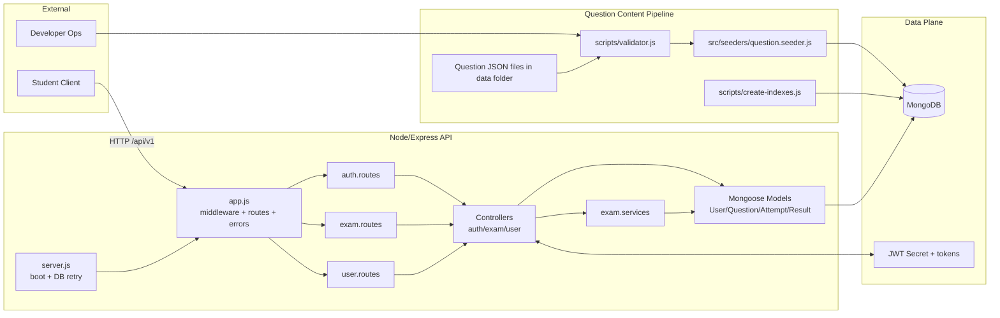
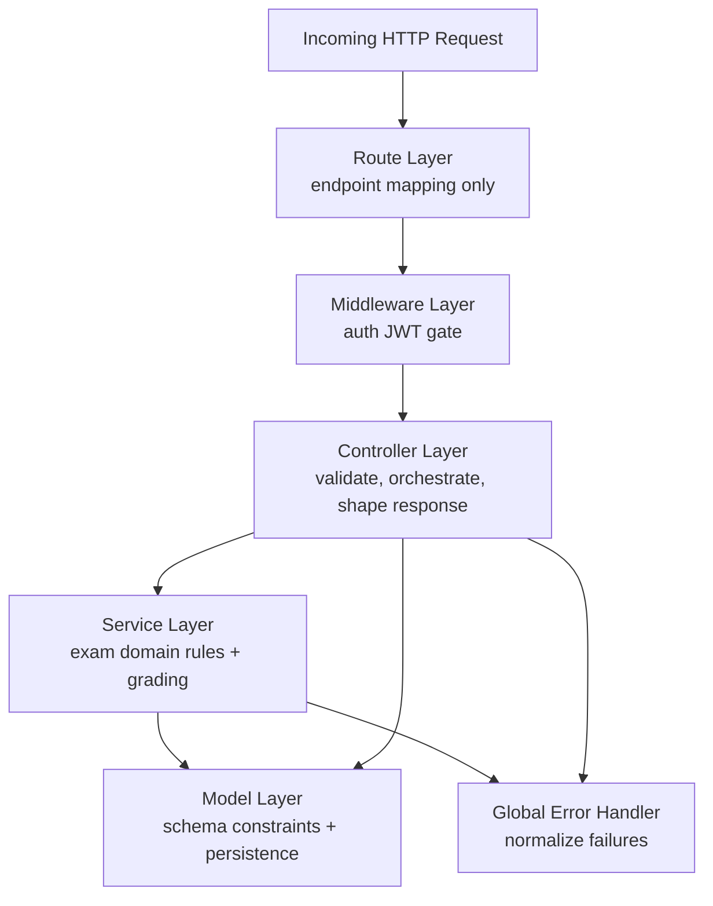
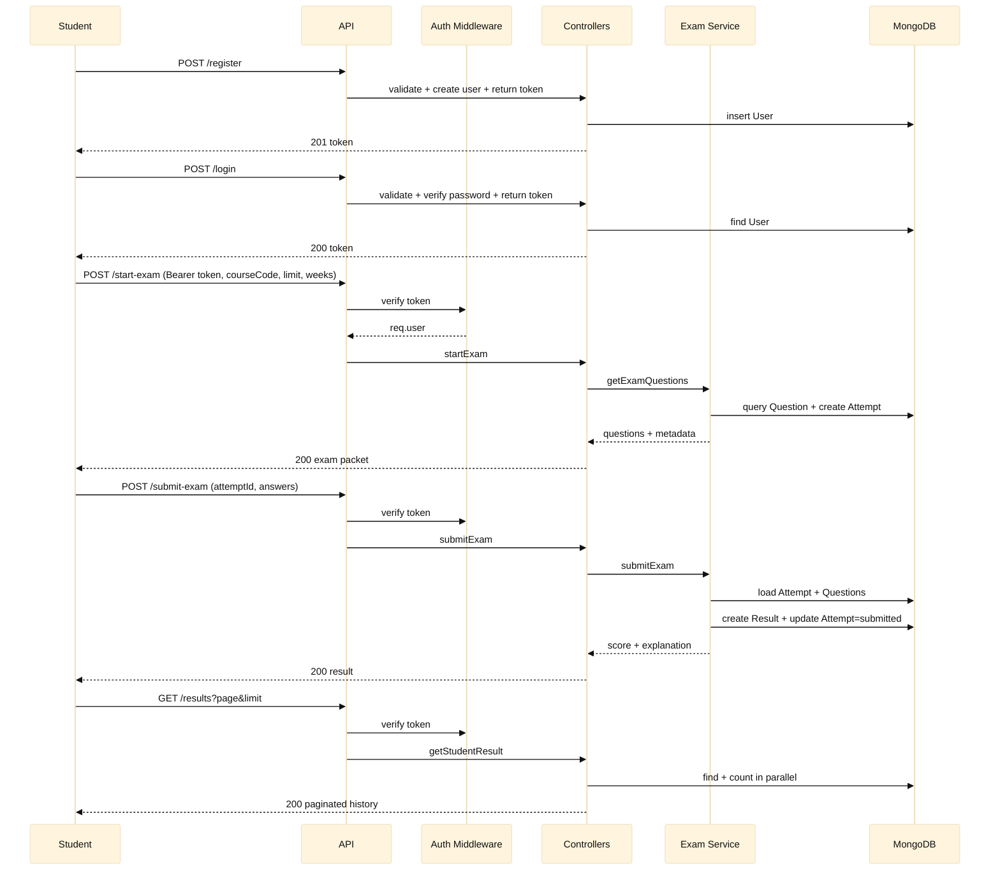
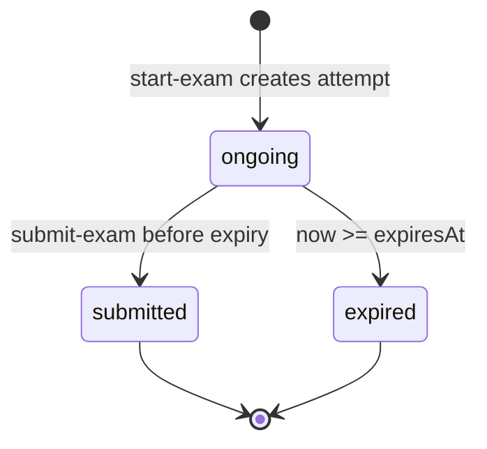
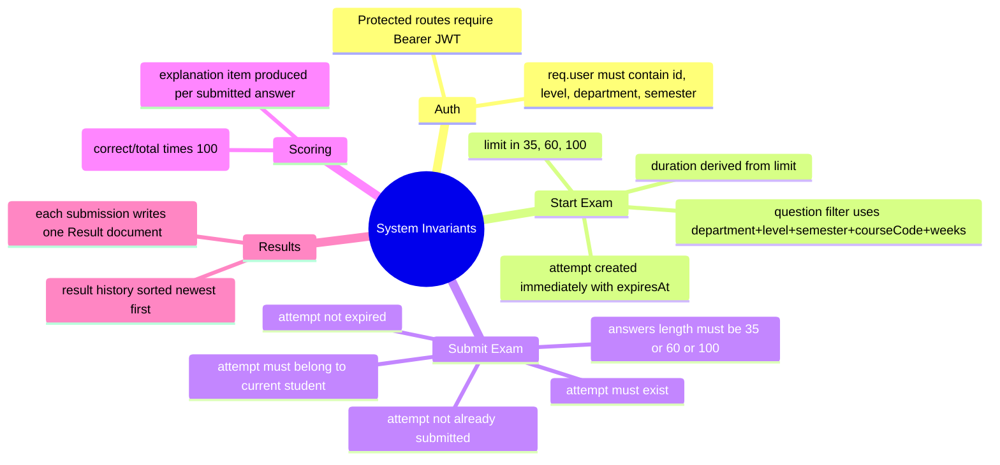
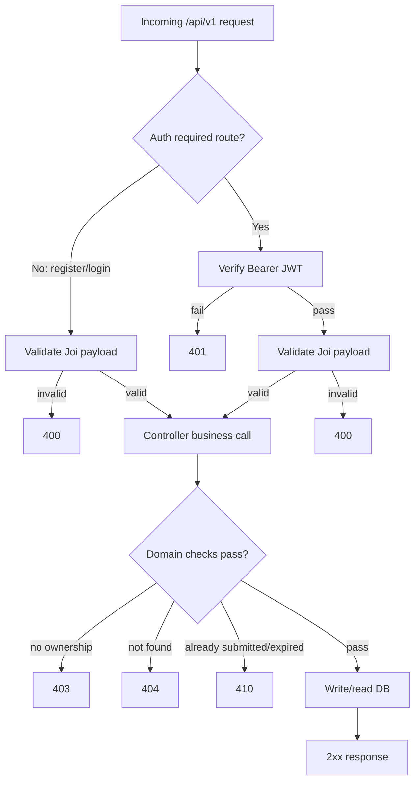
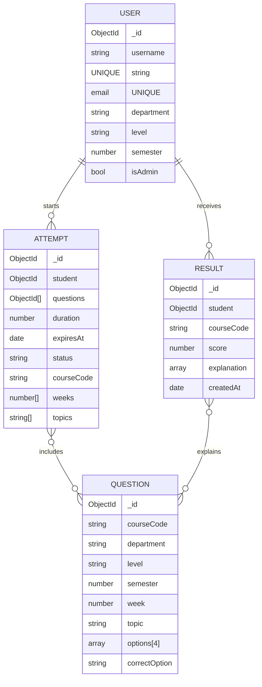
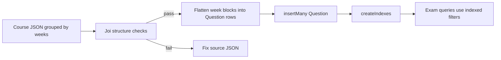

# CBT Platform API Design Doc (Mental Model First)

## 0) How To Read This Document

1. System map: Understand boundaries and major parts.
2. Ownership map: See where each responsibility lives in code.
3. Student journey: Follow one request path from login to result.
4. State and invariants: Learn rules that keep behavior correct.
5. Data lifecycle: Understand how question content reaches runtime.

## 1) One-Screen System Map

## 2) Ownership Map (Where To Look In Code)

Responsibility summary:

- Routes: map URL to controller.
- Middleware: enforce authentication and attach req.user.
- Controllers: Joi validation, parameter extraction, response envelope.
- Services: exam selection, attempt checks, scoring, result creation.
- Models: enforce shape and persist data in MongoDB.

## 3) End-To-End Student Journey (Happy Path)

## 4) Core Domain State And Invariants

### 4.1 Attempt State Machine

### 4.2 Invariants That Define Correct Behavior

## 5) Request Decision Tree (Fast Debugging Lens)

## 6) Data Model And Runtime Relationships

## 7) Content Pipeline Mental Model (Validate -> Flatten -> Seed -> Query)

Operational note:

- Current seeder clears Question collection before inserting new data set.
- Result index supports student result history sorting and lookup.

## 8) Mental Shortcut: 5 Questions To Diagnose Any Issue

1. Is this request blocked before controller (JWT or Joi)?
2. If controller is reached, which domain guard failed (ownership, existence, expiry, status)?
3. Which collection should have changed (User, Attempt, Result, Question)?
4. Is this a runtime flow issue or content pipeline issue?
5. Does the error come from domain logic or global error normalization?
